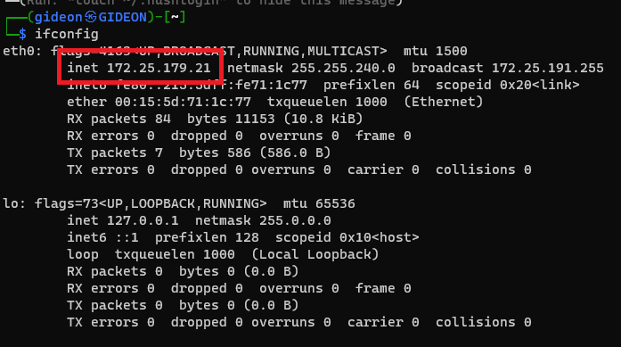

# Lỗi khi cài đặt Wsl xong

- Không truy cập được zeppelin sau khi khởi chạy trên wsl

# Sửa lỗi

1. Thay đổi file config trong zeppelin

- Tìm đường dẫn đến file config 
  
  ```` linux
  cd Zeppelin/zeppelin-0.10.1-bin-all/conf
  ````

  


- Nếu không thấy file **zeppelin-site.xml** thì tiến hành thay đổi tên của file **zeppelin-site.xml.template**
  
  ````linux
  cp zeppelin-site.xml.template zeppelin-site.xml
  ````

- Tiến hành chỉnh sửa file
  
  ````linux
  vim zeppelin-site.xml
  ````
  *Note: bạn có thể sử dụng các trình soạn thảo khác ngoài vim*

- Sửa ip tại tag **\<name\>zeppelin.server.addr\</name\>** từ **127.0.0.1** thành **0.0.0.0**
  
  

- Lưu lại và chạy zeppelin
  
  ````sh
  ./bin/zeppelin-daemon.sh restart
  ````

- Kiểm tra ip của máy ảo
  
  ````cmd
  ifconfig
  ````
  

- Vào mở lại trình duyệt mà đi đến đường dẫn [172.25.179.21:8080](172.25.179.21:8080)
  
  *Note: địa chỉ ip ở trong đường dẫn là địa chỉ ip của máy ảo*


  =====================================
  