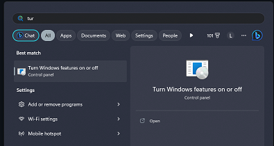
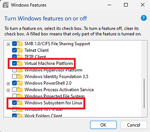
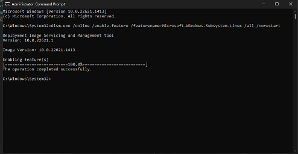
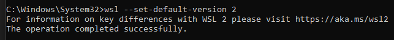
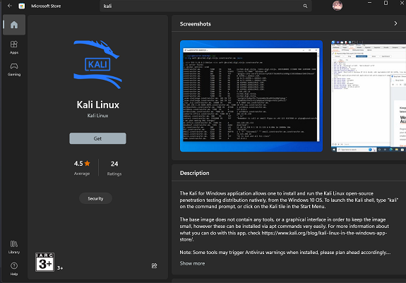
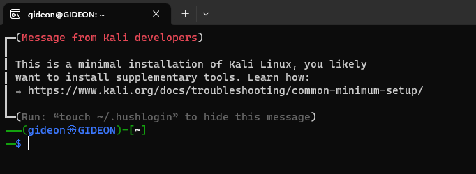
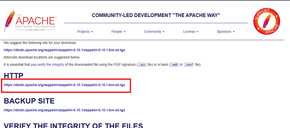
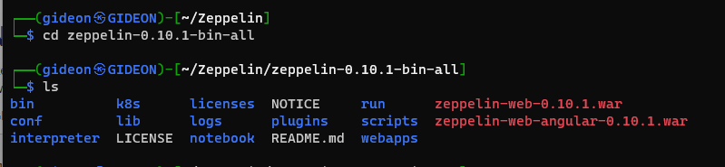

# CÀI ĐẶT MÔI TRƯỜNG

1. Tìm kiếm **Turn Windows feature on or off** từ bảng tìm kiếm windows



2.  Hộp thoại mở ra, tìm kiếm **Windows Subsytem for Linux** và **Virtual Machine Platform** và tick vào 2 ô đó



3. Nhấn **OK** để tiến hành cài đặt môi trường

4. khởi động lại máy và bắt đầu cài đặt wsl

# Cài đặt kali-linux trên WSL version 2
*Hầu hết các version win10, 11 hiện tại đều trên 1903 nên đều hỗ trợ WSL*

1. Bật tính năng WSL trên Windows bằng cách mở Command Prompt với quyền Administrator và chạy lệnh sau:
```` cmd
dism.exe /online /enable-feature /featurename:Microsoft-Windows-Subsystem-Linux /all /norestart
````    


2. Thay đổi version của WSL bằng dòng lệnh
```` cmd
wsl --set-default-version 2
````


3. Mở **Microsoft Store** tìm kiếm **kali linux** và tải về  



4. Tiến hành mở kali và cài đặt

- Đây là giao diện khi cài đặt xong 



- Tiếp theo gõ các lệnh sau để update kali

```` cmd
sudo apt-get update
sudo apt-get upgrade
````

# Cài đặt Zeppelin trên WSL kali

1. Tải **Java Development Kit (JDK)**
   
```` cmd
sudo apt-get install default-jdk
````

2. Tạo folder **Zeppelin**

```` cmd
mkdir Zeppelin
cd Zeppelin
````

2. Tìm kiếm Zeppelin trên trang [Zeppelin download](https://www.apache.org/dyn/closer.cgi/zeppelin/zeppelin-0.10.1/zeppelin-0.10.1-bin-all.tgz)



*Copy link tại **HTTP** để chuẩn bị cho bước sau*

3. Mở kali lên và gõ lệnh

```` cmd
wget <link vừa copy>
````

Ví dụ

```` cmd
wget https://dlcdn.apache.org/zeppelin/zeppelin-0.10.1/zeppelin-0.10.1-bin-all.tgz
````

*Note: Phiên bản hiện tại là 0.10.1, bạn có thể chọn các phiên bản thấp hơn để cài đặt*
*Nhớ địa chỉ lưu file tải xuống là thư mục **Zeppelin** tạo ở **bước 1***

- Sau khi tải xong giải nén bằng cách gõ lệnh

```` cmd
tar -xzf zeppelin-0.10.1-bin-all.tgz
````

4. Giải nén xong tiến hành vào thư nục gốc của zeppelin

```` cmd
cd zeppelin-0.10.1-bin-all
````



5. Chạy zeppelin

````cmd
./bin/zeppelin-daemon.sh start
````