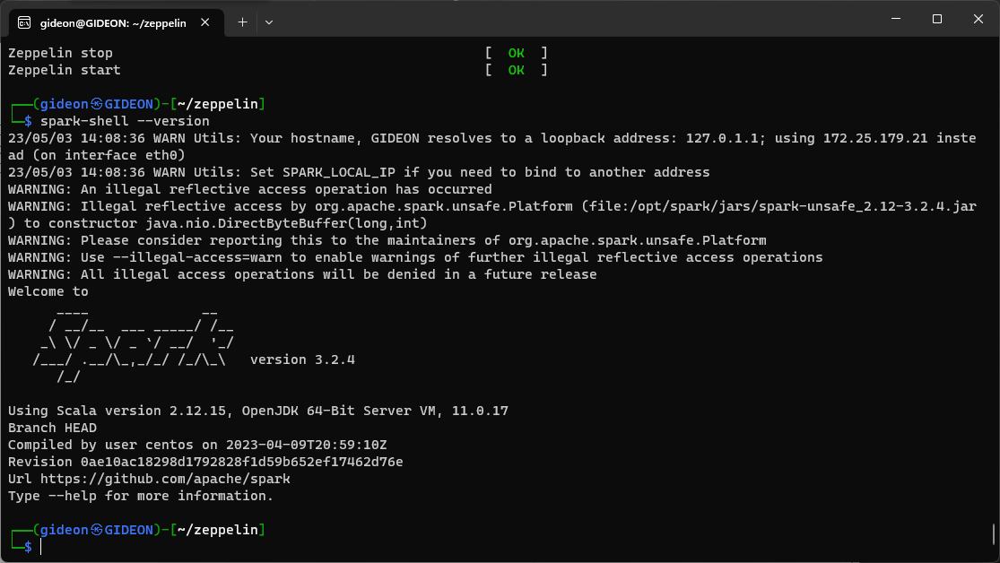

# CÀI ĐẶT APACHE SPARK

   Trước tiên là bạn cần update
   ```sh
   sudo apt-get update
   sudo apt-get -y upgrade
   ```

1. Tải và cài đặt Apache spark
   
   ````sh
   wget https://dlcdn.apache.org/spark/spark-3.2.4/spark-3.2.4-bin-hadoop3.2.tgz
   tar -zxvf spark-3.2.4-bin-hadoop3.2.tgz
   ````

2. Di chuyển đến thư mục **/opt/spark** để tiện việc cài đặt
   
   ````sh
   sudo mv spark-3.2.4-bin-hadoop3.2 /opt/spark
   ````

3. Gõ các dòng sau để thiết lập biến môi trường
   
   ````sh
   export SPARK_HOME=/opt/spark
   export PATH=$SPARK_HOME/bin:$SPARK_HOME/sbin:$PATH
   ````

4. Chạy lệnh sau để kiểm tra
   
   ````sh
   spark-shell --version
   ````

   Nếu như màn hình hiển thị như sau thì đã cài xong

   


# Cài đặt python

   Trước tiên là bạn cần update
   ```sh
   sudo apt-get update
   sudo apt-get -y upgrade
   ```

   Sau đó cài đặt python3, pip, và env

   ````sh
   sudo apt-get install -y python3
   sudo apt-get install -y python3-pip
   sudo apt-get install -y python3-venv
   ````

1. Tạo môi trường ảo cho python trên zeppelin

   ````sh
   cd ~/Zeppelin/zeppelin-0.10.1-bin-all
   python3 -m venv python/venv
   ````

2. Gắn path mới cho python 

   ````sh
   export PATH=~/Zeppelin/zeppelin-0.10.1-bin-all/python/venv/bin:$PATH
   ````


